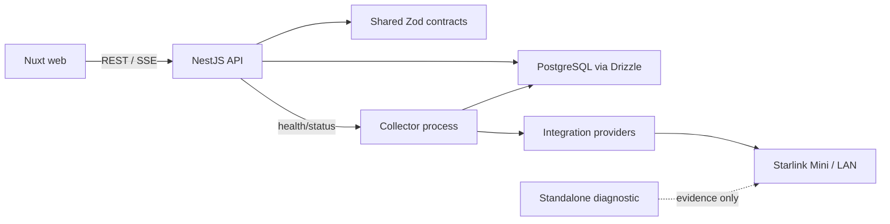

# Architecture

ABD Mission Control is a small monorepo with three runtime applications and shared packages. The API is the only public application boundary; the collector owns device communication and remains useful when the web UI is unavailable. PostgreSQL is the durable source for samples, events, snapshots, incidents, alert occurrences, rules, and daily summaries.

The initial status path proves Browser → API → Collector communication without direct browser-to-device access. Contracts are shared at the boundary, while provider protocol details stay in `packages/integrations`.

## Boundaries

- `web`: rendering and presentation fetching. No Starlink protocol code.
- `api`: authentication-ready public boundary, validation, orchestration, serialization, and OpenAPI.
- `collector`: polling lifecycle, timeouts, retries, normalization, state transitions, and persistence calls.
- `contracts`: runtime schemas and inferred types. External data is parsed before entering the domain.
- `database`: migrations, schema, query/repository code, and client lifecycle.
- `integrations`: narrow provider capability interfaces and isolated implementations.
- `tools/starlink-diagnostic`: one-shot protocol evidence gathering. It is not imported by the collector and cannot write production telemetry.

## Risks and constraints

Starlink Mini local access is an explicit unknown. Phase 1 will validate transport, authentication, method names, and field availability before production integration. Unsupported telemetry must remain unavailable rather than being inferred.

## Phase 2 vertical slice

Starlink protocol code lives in `packages/integrations`; the collector owns polling and persistence orchestration, `packages/database` owns PostgreSQL schema/repositories, and the API owns response DTO boundaries and one process-wide SSE hub. The collector never calls grpcurl. Its verified protobuf subset is version-controlled with the integration package and is not a general Starlink schema.

## Phase 3 outage intelligence

The collector evaluates normalized observations and collector health through a small debounced rule engine. Incidents, alert occurrences, alert rules, and daily summaries are persisted in PostgreSQL. The API serializes these records and publishes incident and alert transitions through the existing bounded in-process SSE hub. No external notification transport is involved.
